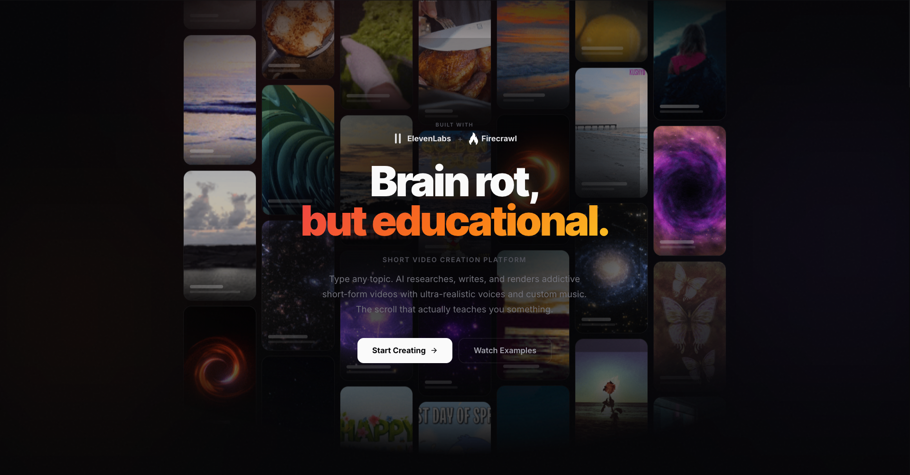
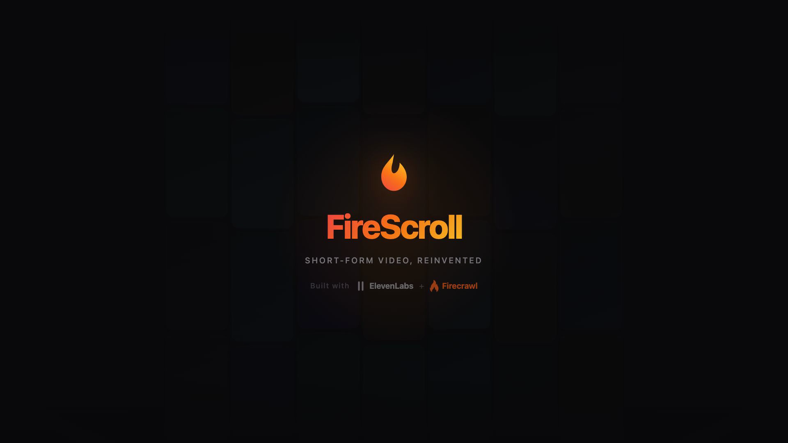

<h1 align="center"> FireScroll</h1>
<p align="center"><strong>Brain rot, but educational.</strong><br/>The scroll that actually teaches you something.</p>

<p align="center">
  <a href="https://www.youtube.com/playlist?list=PLvKK6yXEDiBB6dh2CBuf2Rdr3LdVNj3Hm">
    
  </a>
  <a href="LICENSE">
    
  </a>
</p>

<br />

<p align="center">
  
</p>

## Demo

<table>
  <tr>
    <td align="center" width="50%">
      <a href="https://www.youtube.com/watch?v=485MsI5a450">
        
      </a>
      <br />
      <a href="https://www.youtube.com/watch?v=485MsI5a450"><strong>Overview</strong> — What FireScroll can do</a>
    </td>
    <td align="center" width="50%">
      <a href="https://www.youtube.com/watch?v=vs4SbNTQTww">
        
      </a>
      <br />
      <a href="https://www.youtube.com/watch?v=vs4SbNTQTww"><strong>Live Demo</strong> — Full walkthrough</a>
    </td>
  </tr>
</table>

> Raw demo videos are also available in the [`demo/`](demo/) directory.

## What It Does

Type any topic. FireScroll scrapes the web for real sources, writes scripts backed by citations, narrates them in ultra-realistic AI voices, and renders vertical short-form videos — then serves them in a scrollable feed you can swipe through like TikTok. Except everything you watch actually teaches you something.

The full pipeline from topic to scrollable feed. Runs locally with Docker.

## Features

**Topic → Research → Generate → Scroll.** That's it.

- **Firecrawl-Powered Research** — Six modes: search, scrape, crawl, extract, map, and AI agent. Enter a topic and Firecrawl finds real sources across the web. AI synthesizes them into accurate, citation-backed scripts — broken into segments with hooks, narration, and visual cues.

- **ElevenLabs Voice & Audio** — 50+ ultra-realistic voices across 30+ languages. Five style presets — natural, dramatic, energetic, calm, storyteller. Automatic translation for non-English content. Built-in library of AI-generated music tracks mixed into every video.

- **Scrollable Feed** — Generated videos land in a vertical scroll feed. Swipe through topics the way you'd scroll TikTok or Reels — but every video is AI-researched and educational.

- **Video Studio** — Three visual modes (AI backgrounds, video backgrounds, split-screen), two caption styles (overlay, karaoke word-by-word sync), configurable voice and music per segment. One-click batch generation. 1080×1920 MP4 at 30fps.

- **Media Library** — Upload your own background videos. Audio stripped automatically. Shared across all projects.

## Getting Started

### Prerequisites

- [Docker](https://docs.docker.com/get-docker/) and Docker Compose
- **All three** API keys below are required:

| Key | Purpose |
|-----|---------|
| [OpenAI](https://platform.openai.com/api-keys) | Script generation, image backgrounds |
| [ElevenLabs](https://elevenlabs.io) | Voice narration, multilingual TTS |
| [Firecrawl](https://firecrawl.dev) | Web research and source extraction |

### Run

```bash
git clone https://github.com/arun477/firescroll.git
cd firescroll
docker compose up --build
```

Open [localhost:3500](http://localhost:3500) and add your API keys in **Settings** first.

### Usage

1. **Create a topic** — enter any subject.
2. **Research** — Firecrawl scrapes the web, AI writes the scripts.
3. **Generate** — pick a voice, configure visuals, hit generate.
4. **Scroll** — swipe through your feed.

## Roadmap

- [ ] **PostgreSQL migration** — replace SQLite with PostgreSQL for production-grade persistence and concurrent writes
- [ ] **Packaging** — streamline setup beyond Docker Compose, pre-built images on Docker Hub, reduce cold-start build time
- [ ] **Social export** — one-click publish to YouTube Shorts, TikTok, and Reels with platform-specific formatting
- [ ] **Shareable feed links** — public URLs for generated feeds so viewers can scroll without running the app
- [ ] **Multi-tenant auth** — user accounts, teams, and shared workspaces
- [ ] **Scheduled generation** — set a topic and cadence, FireScroll researches and generates new videos on autopilot
- [ ] **Analytics** — track watch time, completion rate, and engagement per video
- [ ] **Mobile-first PWA** — installable app experience for the scroll feed on phones

## Built With

Built for the [Firecrawl](https://firecrawl.dev) x [ElevenLabs](https://elevenlabs.io) Hackathon.

- [Firecrawl](https://firecrawl.dev) — The research backbone. Search API gives AI agents real-time knowledge from any website in a single call. Six modes power the entire content pipeline — from web search to structured extraction.
- [ElevenLabs](https://elevenlabs.io) — The voice layer. 50+ voices across 30+ languages turn every script into broadcast-quality narration. Style presets and speed controls make each video sound intentional, not robotic.
- [Remotion](https://remotion.dev) — Programmatic video rendering in React.
- [OpenAI](https://openai.com) — Script generation, image backgrounds, and AI orchestration.

## License

This project is licensed under the MIT License — see the [LICENSE](LICENSE) file for details.
